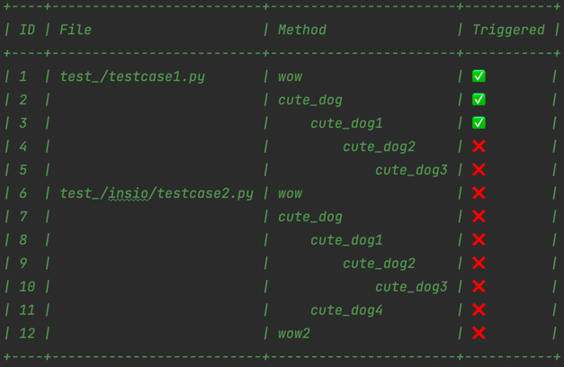
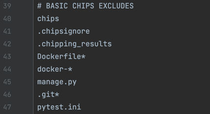

# 👾 Chips

Chips is a tool that inserts "chips" to your code, detecting unused fragments. Then shows unused functions in a pretty table. Might be used for developing, refactoring and manual testing purposes

## Installation

Use the package manager [pip](https://pip.pypa.io/en/stable/) to install Chips.

```bash
pip install python-chips
```

## Usage

1) Add chips to your project (-a --add)

```bash
python -m chips --add
```
2) Use your code (trigger functions in a way: make api requests, click website, etc..)

3) See the auto generated results at .chipping_results/results.py in a pretty table



4) Remove chips (-r --remove)
```bash
python -m chips --remove
```

## Ignore particular dirs and files
To exclude particular dirs and files from chipping (f.e. tests and manage.py in Django) 
Chips generate a .chipsignore file, based on your .gitignore. Syntax is the same.

There's a basic excludes list in .chipsignore. You can modify it any time you want.



## Chipping path
Basically Chips are performing on a root path of your project. You can specify a folder path, where you want Chips to perform. Use -p --path arg.
```bash
python -m chips -a -p <DESIRED PATH>
```

## Bad performance
If you struggle from a bad performance after chipping, use --auto off to turn off auto generated results
```bash
python -m chips -a --auto off
```

Then you'll need to generate results manually (-rs --results)
```bash
python -m chips --results
```

## Chips logging
Choose logging type. Can be applied to remove and add.
list_files (default for add) - list all affected files, 
count_files (default for remove)- print number of files affected(-rt --result_type),
blind = no output
```bash
python -m chips -a -rt count_files
```

## Contributing
Pull requests are welcome. For major changes, please open an issue first to discuss what you would like to change.